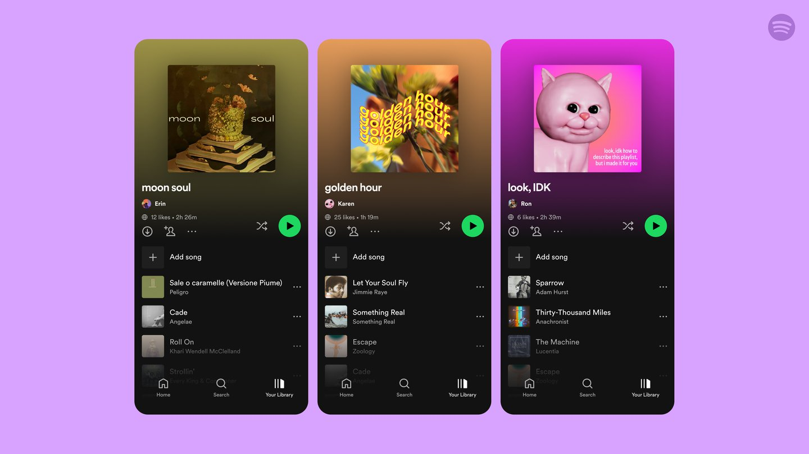
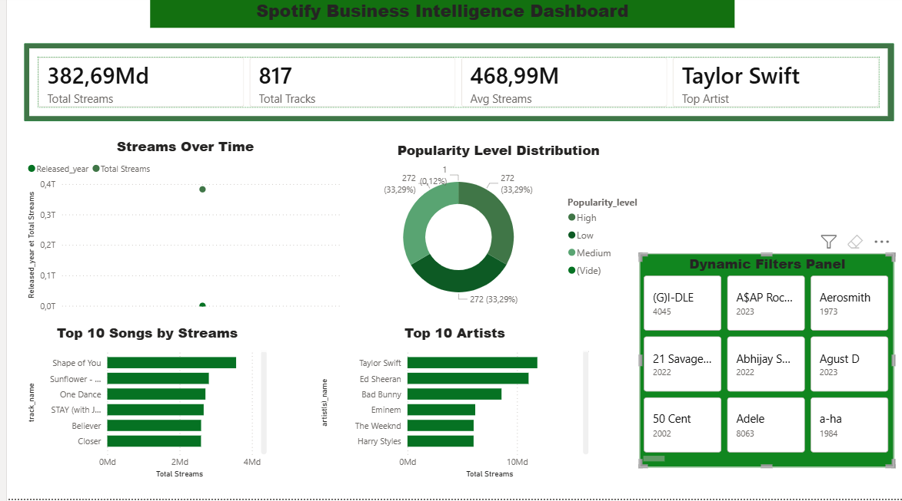

# Spotify-Data-Analysis-Interactive-Power-BI-Dashboard

End-to-end Spotify data analysis project using Python (EDA, data cleaning) and Power BI (interactive dashboard with advanced DAX measures) to uncover music trends and artist performance insights.

## 📌 PROJECT OVERVIEW

This project presents an end-to-end data analysis of Spotify tracks using Python and Power BI. The dataset was cleaned and transformed in Jupyter Notebook, followed by exploratory data analysis (EDA) to uncover trends in music popularity, artist performance, and audio features.

An interactive Power BI dashboard was developed using advanced DAX measures (KPIs, ranking, growth rate, and cumulative metrics) to visualize insights and support data-driven decision-making.

---

## 🧰 TOOLS & TECHNOLOGIES
- Python (Pandas, Matplotlib, Seaborn)
- Jupyter Notebook
- Power BI
- SQL

---

## 🧹 DATA CLEANING
- Converted `streams` column to numeric
- Handled missing values
- Removed duplicates
- Created new features (popularity level, release date)

---

## 📊 EXPLORATORY DATA ANALYSIS (EDA)
- Distribution of songs by popularity
- Top artists and tracks
- Correlation between audio features
- WordCloud visualization (artists & track names)

---

## 📈 POWER BI DASHBOARD
### KEY FEATURES :
- KPIs: Total Streams, Avg Streams, Total Tracks
- Top Artists & Songs
- Audio Feature Analysis (energy, danceability, etc.)
- Trends over time
- Interactive filters & dynamic visuals

---

## 🧠 KEY INSIGHTS
- High energy and danceability are often associated with popular songs
- A small number of artists dominate total streams
- Music trends evolve significantly over years

---

## 🚀 FUTURE IMPROVEMENTS
- Machine Learning model to predict song popularity
- Real-time data integration
- Advanced dashboard storytelling

---

## Dashboard Preview

## 🚀 Live Portfolio  
👉 **Portfolio Link **: https://rihabdata.github.io/RIHABM.github.io/

---

## 🤝 Contact  
Feel free to reach out for collaborations or internship opportunities.  
📧 Email: morafiqrihab037@gmail.com  
🔗 LinkedIn: 
